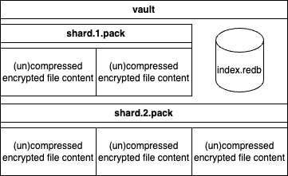

# `fvault`

- file vault
- store and load files
- `git`-like repo user interface
- `rsync`-friendly pack files

## Usage

```bash
fvt init
vim secret.txt
fvt store secret.txt
rm secret.txt
fvt en
fvt de
fvt ls
fvt load secret.txt
vim secret.txt
```

## File format


